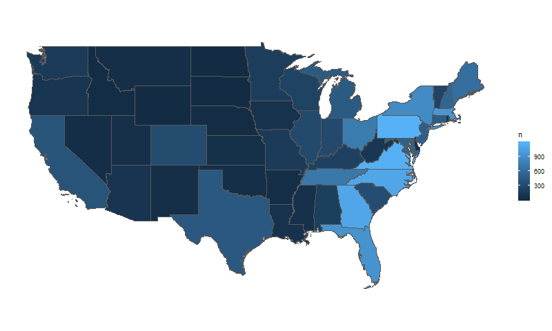

---
---
# [Homepage](https://tpsteiner.github.io/)

In 2018 I hiked the Appalachian Trail. Soon after my journey, I discovered that there is public data over the population of individuals who completed the hike. Sounds like a fun data wrangling session. Let's get at it!

## Background

The Appalachian Trail (AT) is a marked hiking trail in the Eastern United States. It extends nearly 2,200 miles between Georgia and Maine. Each year a number of hikers complete the entire trail. If a hiker finishes the AT, they can optionally register with the Appalachian Trail Conservancy as a finisher. Registration is entirely based on the honor system. There are many hikers that do not register at all, and many that register without actually meeting the requirements.

Each year the ATC uploads a list of registered finishers to [ATC 2000 Milers Listing](http://appalachiantrail.org/home/community/2000-miler-listing). I made a script to grab every list since 1980, and kept 95% of the entries. I will use this data below to summarize the population of registered AT finishers. Though this is only a sample of all AT finishers, the size of the sample is probably large enough to make conclusions about the total population.

Please enjoy these _ultra_ fun facts about AT finishers.


## For the nerds who want to replicate my code

All of the code used, along with web-scraping and data cleaning, can be found [here](https://github.com/tpsteiner/trailfinishers/tree/master/R). If you want to skip to the good stuff, just download [hiker\_data.csv](https://github.com/tpsteiner/trailfinishers/blob/master/data/hiker%5Fdata.csv).

```R
 ## Load required functions ##
library(tidyverse)
library(lubridate)
library(tigris)
library(sf)

 ## Load the data set ##
hiker_data <- read_csv("static/datasets/hiker_data.csv")
```


## This is what the dataset looks like

```R
 ## Show 5 random rows ##
sample_n(hiker_data, 5)
```

| year | last\_name  | first\_name   | trail\_name | state | country | direction | city        | finish\_date |
|------|-------------|---------------|-------------|-------|---------|-----------|-------------|--------------|
| 2016 | Chapman     | Christopher   | Beaver      | TN    | USA     | NOBO      | nil         | nil          |
| 2015 | Lewis       | Elizabeth Ann | Towanda     | NC    | USA     | NOBO      | Newland     | 08-31-15     |
| 2010 | Christopher | Brian         | Spork       | PA    | USA     | NOBO      | Springfield | 09-11-10     |
| 2014 | Pruner      | Marcia K.     | Sweet Peace | VA    | USA     | Section   | Lebanon     | 09-20-14     |
| 2015 | Stephenson  | Joseph        | Spike       | TN    | USA     | Flip      | Kingston    | 12-04-15     |


## Here's what I learned...


### 4/5 Finishers are thru-hikers

Hikers that finish in under a year are called thru-hikers. Most thru-hikers start their hike in Georgia and finish in Maine (NOBO = Northbound). The rest are evenly split between Southbound and flip-flopping (both directions).

```R
hiker_data %>%
  count(direction) %>%
  arrange(desc(n)) %>%
  mutate(`proportion_of_hikers` = paste0(100*round(n/sum(.$n), 2),"%"))
```

| direction | n     | proportion\_of\_hikers |
|-----------|-------|------------------------|
| NOBO      | 11555 | 66%                    |
| Section   | 3188  | 18%                    |
| SOBO      | 1598  | 9%                     |
| Flip      | 1185  | 7%                     |


### 19/20 Finishers are from the US

```R
hiker_data %>%
  mutate(country = if_else(country == "USA", "USA", "Other")) %>%
  count(country) %>%
  arrange(desc(n)) %>%
  mutate(`proportion_of_hikers` = paste0(100*round(n/sum(.$n), 2),"%"))
```

| country | n     | proportion\_of\_hikers |
|---------|-------|------------------------|
| USA     | 16699 | 95%                    |
| Other   | 508   | 3%                     |
| nil     | 319   | 2%                     |


### Most International Finishers are from Canada or Germany

Of the ~5% of international hikers, the most common home countries are Canada and Germany. Canada makes sense, being so close. Germany on the otherhand was a bit of a surprise. My hunch is that this [German Documentary](https://www.youtube.com/watch?v=JRWsnYL%5F1kA) is the reason so many Germans hike the trail.

```R
hiker_data %>%
  filter(!(country %in% c("USA", "", NA))) %>%
  count(country) %>%
  arrange(desc(n)) %>%
  mutate(`proportion_of_international_hikers` = paste0(100*round(n/sum(.$n), 2),"%")) %>%
  head(10)
```

| country | n  | proportion\_of\_international\_hikers |
|---------|----|---------------------------------------|
| ON      | 43 | 8%                                    |
| Qu      | 25 | 5%                                    |
| DEU     | 23 | 5%                                    |
| CANADA  | 22 | 4%                                    |
| QC      | 22 | 4%                                    |
| GERMANY | 17 | 3%                                    |
| Germany | 16 | 3%                                    |
| NB      | 13 | 3%                                    |
| AB      | 12 | 2%                                    |
| NS      | 11 | 2%                                    |


### 94% of Finishers use Trail Names

949 of the total 17500 hikers did not have trail names (nil). They were the minority. "Sunshine" and other names listed below were the John Smiths of trail names.

```R
hiker_data %>%
  group_by(trail_name) %>%
  count() %>%
  arrange(desc(n)) %>%
  head(10)
```

| trail\_name | n   |
|-------------|-----|
| nil         | 949 |
| Doc         | 24  |
| Sunshine    | 22  |
| Moose       | 20  |
| Turtle      | 20  |
| Rabbit      | 19  |
| Stretch     | 19  |
| Strider     | 17  |
| Pilgrim     | 15  |
| Scout       | 15  |


### Most American Finishers live next to the trail

```R
state_count <- hiker_data %>%
  group_by(state) %>%
  count()

states_sp <- states(cb = TRUE)
states_sf = st_as_sf(states_sp)

hiker_states <- inner_join(states_sf, state_count, by = c("STUSPS" = "state")) %>%
  filter(NAME != "Alaska", NAME != "Hawaii")

ggplot(hiker_states) +
  geom_sf(aes(fill = n)) +
  coord_sf(datum = NA) +
  theme(panel.background = element_blank())
```




### Most hikers finish the trail between July and December

Section hikers on average finish first, follwed by Northbounders, then flip-floppers, and lastly Southbounders

```R
plot_data <- hiker_data %>%
  remove_missing(TRUE) %>%
  filter(mdy(finish_date) > mdy("12-31-99")) %>%
  mutate(month = month(mdy(finish_date), label = TRUE, abbr = FALSE)) %>%
  group_by(direction, month) %>%
  count() %>%
  group_by(direction) %>%
  mutate(proportion = n/sum(n))

ggplot(plot_data, aes(month, proportion)) +
  geom_bar(aes(group = direction), stat = "identity") +
  facet_wrap(~direction, nrow = 4, scales = "free_y") +
  theme_bw(base_size = 20) +
  theme(axis.text.y = element_blank(),
        axis.text.x = element_text(angle = 90, hjust = 1, vjust = .5)) +
  ggtitle("Hikers finish at different times of the year depending on
what direction they hiked") +
  ylab("% of hikers") +
  xlab("Month of AT completion")
```


